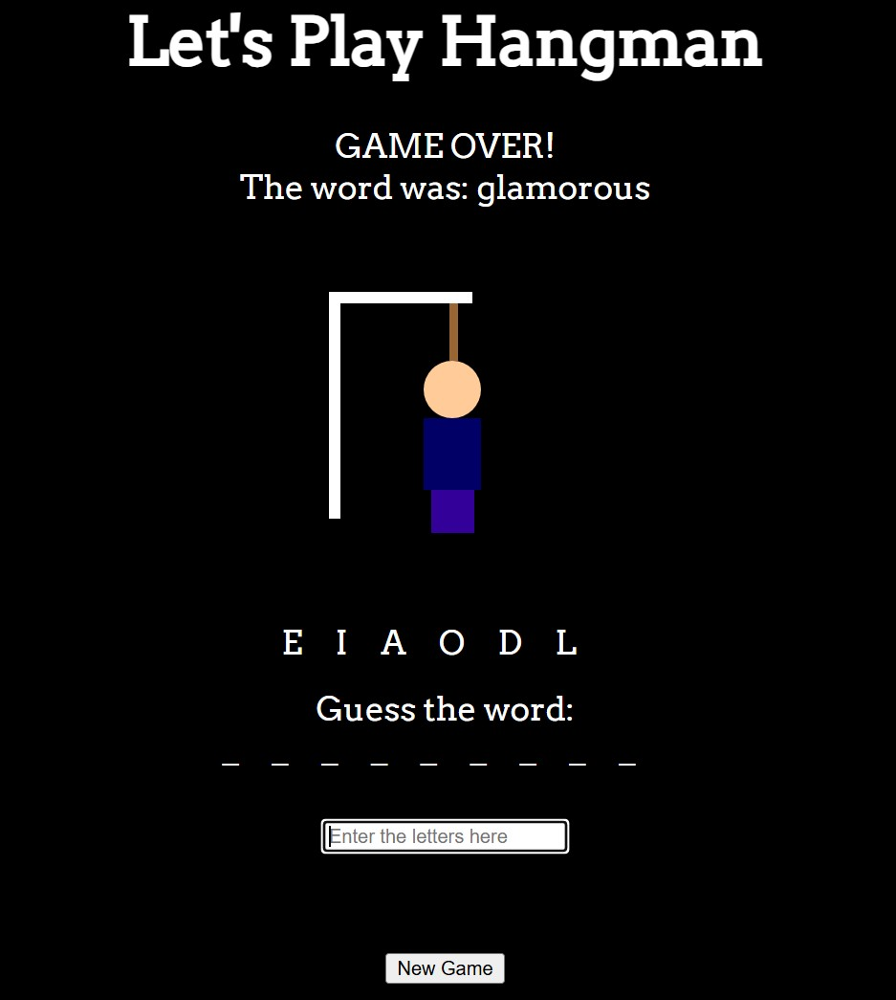

# Hangman-js

The traditional hangman puzzle game written as prototype object class in vanilla Javascript.

## Screenshot

## Links

- Project URL: [GitHub Repository](https://github.com/apache2op/HangmanJS)
- Live Site URL: [Live Site]()

## Built with

- HTML5
- CSS3
- JavaScript
